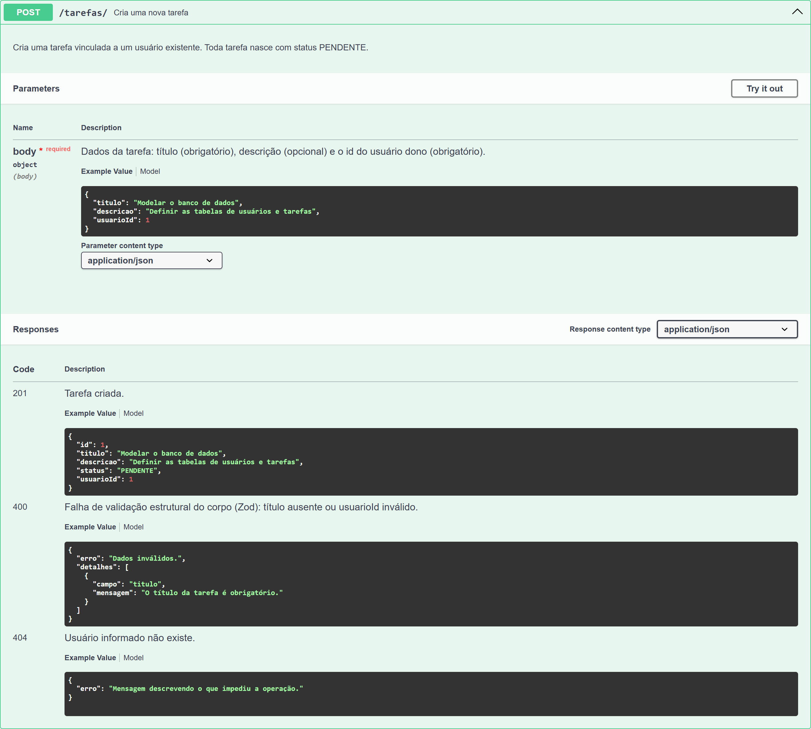
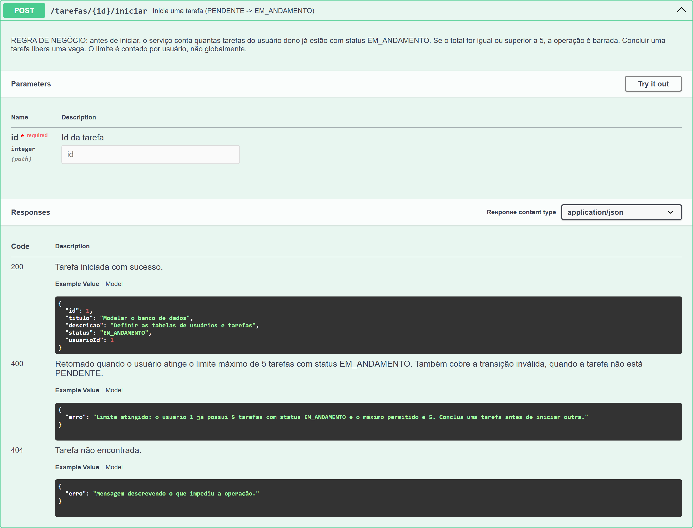

# Evidências da entrega

Prints da interface do Swagger (`http://localhost:3000/api-docs`), capturados com a API rodando.

## Print 1 — esquema de entrada (Body) da criação de Tarefas



`POST /tarefas` expandido, mostrando o corpo esperado (`titulo`, `descricao`, `usuarioId`),
quais campos são obrigatórios e as respostas possíveis — incluindo o `400` de falha de
validação estrutural do Zod, com o detalhamento por campo.

## Print 2 — regra de negócio na rota de iniciar tarefa



`POST /tarefas/{id}/iniciar` expandido, exibindo a documentação do erro referente ao
**limite de 5 tarefas em andamento**:

- **200** — Tarefa iniciada com sucesso.
- **400** — _"Retornado quando o usuário atinge o limite máximo de 5 tarefas com status
  EM_ANDAMENTO."_

O exemplo de resposta do `400` traz a mensagem que a API devolve de fato, e o do `200` mostra
a tarefa já com status `EM_ANDAMENTO`.

## Como reproduzir

```bash
npm install
npm run swagger
npm run seed
npm start
```

Depois abra `http://localhost:3000/api-docs` e expanda os dois endpoints.
